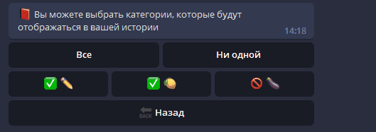
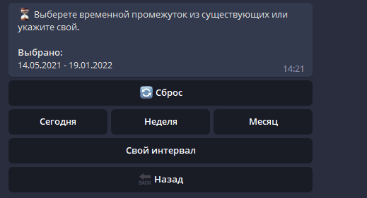

<p>
  
  
  
</p>

# SmartExp
## Categories
User can create personalized categories which are visible as emoji. User can assign category to an expense or income and perform a search based on the category.

## Income & Expense creation process
<details open>
<summary>Creating an expense</summary>
<br>
<p align="center">
  
</p>
</details>

## History an filters
User can filter expense and income records by:
- Category
- Date
- Type (Expenses / Income)

### Category filtering
User can select several or all categories to perform a search query

<p align="center">
  
</p>

### Date filtering
User has several options: 
 - Today
 - Week
 - Month
 - Own interval

With own interval user can define custom interval via sending a message in *DD.MM.YY* format

<p align="center">
  
</p>

### Type filtering
User can choose between *Expenses / Incomes* or both 

<p align="center">
  
</p>

<details open>
<summary>Viewing and filtering history</summary>
<br>
<p align="center">
  
</p>
</details>


## Getting started
### Install

```sh
$ npm install
```
configure `.env` file (*use `.env.example` file*)

### Run

```sh
$ npm run start
```
